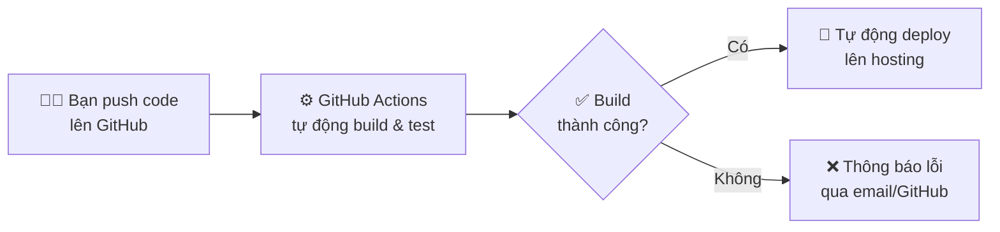
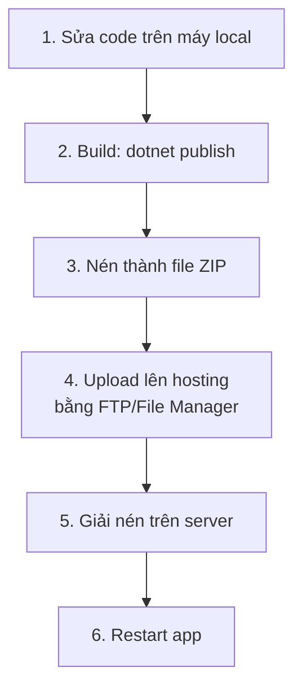
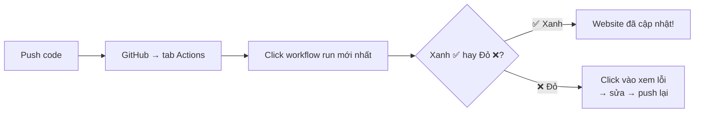
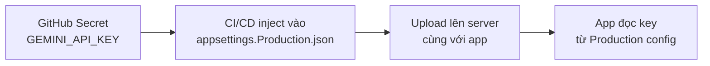
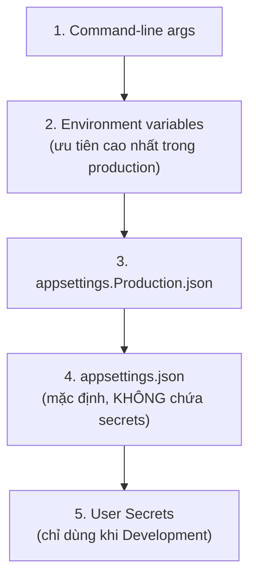
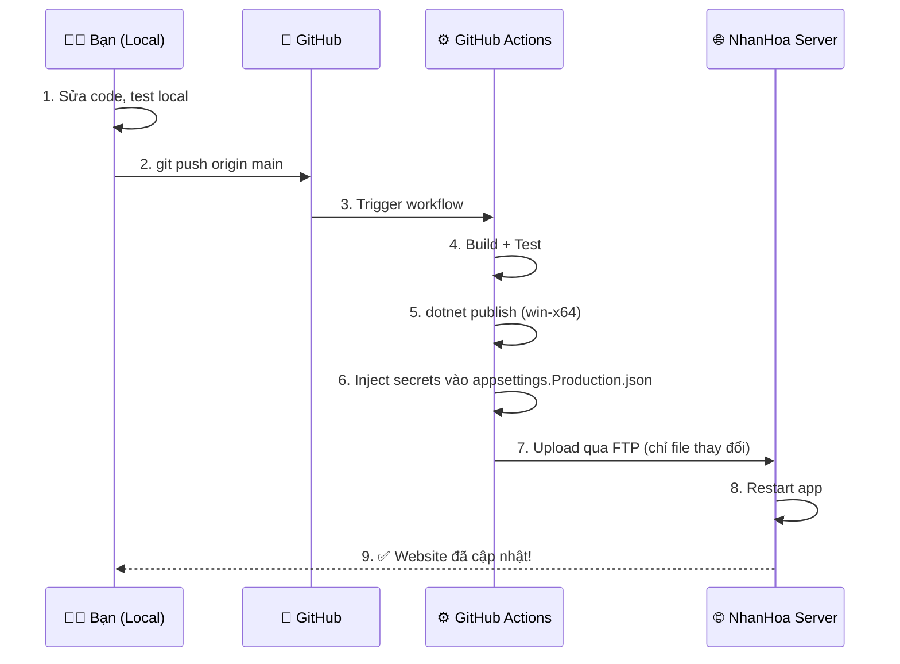

# Hướng Dẫn CI/CD & Deployment Cho TCT English

> [!NOTE]
> Tài liệu này hướng dẫn **từng bước** cách thiết lập tự động deploy từ GitHub lên NhanHoa Windows hosting (IIS), và cách quản lý API key (Gemini, OAuth, v.v.) trên production.
> 
> **Bạn chỉ cần đọc và làm theo thứ tự từ trên xuống.**

---

## Mục Lục

1. [CI/CD Là Gì?](#1-cicd-là-gì)
2. [So Sánh: Deploy Thủ Công vs Tự Động](#2-so-sánh-deploy-thủ-công-vs-tự-động)
3. [Thiết Lập Từng Bước](#3-thiết-lập-từng-bước)
4. [Chi Tiết File Workflow](#4-chi-tiết-file-workflow)
5. [Cách Quản Lý Gemini API Key Trên Production](#5-cách-quản-lý-gemini-api-key-trên-production)
6. [Bảo Mật: Làm Sạch Secrets Khỏi Source Code](#6-bảo-mật-làm-sạch-secrets-khỏi-source-code)
7. [Quy Trình Làm Việc Hàng Ngày](#7-quy-trình-làm-việc-hàng-ngày)
8. [FAQ - Câu Hỏi Thường Gặp](#8-faq---câu-hỏi-thường-gặp)
9. [Nâng Cấp Trong Tương Lai](#9-nâng-cấp-trong-tương-lai)

---

## 1. CI/CD Là Gì?



| Thuật ngữ | Ý nghĩa |
|-----------|---------|
| **CI** (Continuous Integration) | Mỗi khi push code lên GitHub → tự động build + chạy test để phát hiện lỗi sớm |
| **CD** (Continuous Deployment) | Sau khi CI pass → tự động deploy lên server production |
| **GitHub Actions** | Dịch vụ CI/CD **miễn phí** tích hợp sẵn trong GitHub |
| **Docker** | "Container" đóng gói app + dependencies → chạy ở bất kì đâu giống nhau |

### CI/CD vs Docker — Bạn cần cái nào?

| | CI/CD (GitHub Actions) | Docker |
|---|---|---|
| **Mục đích** | Tự động hóa quy trình build → deploy | Đóng gói app thành container |
| **Bạn có cần?** | ✅ **CÓ** — đây là thứ bạn cần | ⚠️ Tùy chọn — phụ thuộc hosting |
| **Phù hợp khi** | Hosting hỗ trợ FTP/SSH hoặc VPS | Hosting hỗ trợ Docker (VPS, cloud) |
| **NhanHoa shared hosting** | ✅ Dùng FTP deploy | ❌ Không hỗ trợ Docker |
| **NhanHoa VPS** | ✅ Dùng SSH deploy | ✅ Có thể dùng Docker |

> [!IMPORTANT]
> **Với hosting NhanHoa hiện tại của bạn (Windows shared hosting + IIS):** Dùng **GitHub Actions + FTP deploy** là phương án phù hợp nhất. Docker chỉ cần khi bạn dùng VPS hoặc cloud hosting.

---

## 2. So Sánh: Deploy Thủ Công vs Tự Động

### Hiện tại (thủ công) 😓



**Vấn đề:** Tốn thời gian, dễ quên build hoặc quên copy file, không có test tự động, không track version.

### Sau khi thiết lập CI/CD 🚀

```
Sửa code → git push → ☕ Chờ 3 phút → Website đã cập nhật!
```

---

## 3. Thiết Lập Từng Bước

### Bước 1: Thêm Secrets vào GitHub Repository

Vào GitHub repo → **Settings** → **Secrets and variables** → **Actions** → **New repository secret**

Thêm **từng secret** sau:

| # | Secret Name | Giá trị | Mô tả |
|---|-------------|---------|-------|
| 1 | `FTP_SERVER` | Địa chỉ FTP của NhanHoa (VD: `ftp.yourdomain.com`) | FTP host |
| 2 | `FTP_USERNAME` | Username FTP | FTP user |
| 3 | `FTP_PASSWORD` | Password FTP | FTP pass |
| 4 | `FTP_REMOTE_DIR` | Thư mục chứa app trên server (VD: `/public_html/`) | Đường dẫn remote |
| 5 | `PRODUCTION_DB_CONNECTION` | Connection string MariaDB production | DB connection |
| 6 | `GOOGLE_CLIENT_ID` | Google OAuth Client ID | OAuth |
| 7 | `GOOGLE_CLIENT_SECRET` | Google OAuth Client Secret | OAuth |
| 8 | `FACEBOOK_APP_ID` | Facebook App ID | OAuth |
| 9 | `FACEBOOK_APP_SECRET` | Facebook App Secret | OAuth |
| 10 | `SMTP_EMAIL` | `support.tctenglish@gmail.com` | Email |
| 11 | `SMTP_PASSWORD` | Gmail App Password | Email |
| 12 | `GEMINI_API_KEY` | Gemini API key của bạn | AI |
| 13 | `PIXABAY_API_KEY` | Pixabay API key (nếu có) | Images |

> [!CAUTION]
> **QUAN TRỌNG:** File `appsettings.json` trong repo hiện đang chứa **Google OAuth secrets, Facebook secrets, SMTP password và connection string thật**! Đây là lỗ hổng bảo mật nghiêm trọng. Xem [Mục 6](#6-bảo-mật-làm-sạch-secrets-khỏi-source-code) để dọn dẹp.

### Bước 2: Kiểm tra file workflow

File `.github/workflows/deploy.yml` đã có sẵn trong repo. Xem chi tiết tại [Mục 4](#4-chi-tiết-file-workflow).

### Bước 3: Cập nhật `web.config` trên server (BẮT BUỘC cho Windows/IIS)

> [!WARNING]
> Đây là bước **quan trọng nhất** cho Windows hosting. Nếu thiếu bước này, app sẽ chạy ở mode Development và **KHÔNG đọc được** `appsettings.Production.json` → tất cả secrets (Gemini key, DB, OAuth) sẽ trống!

Đảm bảo file `web.config` trên server có nội dung sau:

```xml
<?xml version="1.0" encoding="utf-8"?>
<configuration>
  <location path="." inheritInChildApplications="false">
    <system.webServer>
      <handlers>
        <add name="aspNetCore" path="*" verb="*" modules="AspNetCoreModuleV2" resourceType="Unspecified" />
      </handlers>
      <aspNetCore processPath=".\TCTEnglish.exe" stdoutLogEnabled="false" stdoutLogFile=".\logs\stdout" hostingModel="inprocess">
        <environmentVariables>
          <environmentVariable name="ASPNETCORE_ENVIRONMENT" value="Production" />
        </environmentVariables>
      </aspNetCore>
    </system.webServer>
  </location>
</configuration>
```

**Cách thực hiện:**
1. Kết nối FTP đến server NhanHoa
2. Tìm thư mục chứa app (nơi có `TCTEnglish.exe`)
3. Mở file `web.config` → kiểm tra đã có dòng `ASPNETCORE_ENVIRONMENT` = `Production` chưa
4. Nếu chưa → sửa lại theo mẫu trên → save

### Bước 4: Push và kiểm tra

```powershell
git add .
git commit -m "ci: add GitHub Actions CI/CD pipeline"
git push origin main
```

Sau đó vào GitHub → tab **Actions** → xem pipeline chạy.



---

## 4. Chi Tiết File Workflow

File `.github/workflows/deploy.yml` gồm 2 jobs:

### Job 1: `build` (CI)

| Bước | Mô tả |
|------|-------|
| 1 | Checkout code từ GitHub |
| 2 | Setup .NET 9 |
| 3 | Restore NuGet packages |
| 4 | Build project (Release) |
| 5 | Chạy unit tests (nếu có test project) |
| 6 | `dotnet publish` — self-contained cho **Windows** (`win-x64`) vì server dùng IIS + `TCTEnglish.exe` |
| 7 | Upload artifact |

### Job 2: `deploy` (CD)

| Bước | Mô tả |
|------|-------|
| 1 | Download artifact từ job Build |
| 2 | Tạo `appsettings.Production.json` từ GitHub Secrets (chứa Gemini key, DB connection, OAuth, SMTP, v.v.) |
| 3 | Upload lên NhanHoa qua FTP (**incremental** — chỉ upload file thay đổi, nên rất nhanh) |

> [!TIP]
> Pipeline chỉ chạy khi push vào branch `main`. Bạn có thể tạo branch `develop` để code hàng ngày, rồi merge vào `main` khi muốn deploy.

---

## 5. Cách Quản Lý Gemini API Key Trên Production

### Vấn đề

- **Chạy local:** Gemini API key lưu trong User Secrets → ✅ hoạt động tốt
- **Chạy trên production:** Không có User Secrets → ❌ key bị trống → tính năng AI không chạy

### Giải pháp: Pipeline CI/CD tự inject



**Bạn chỉ cần:** Thêm secret `GEMINI_API_KEY` vào GitHub (đã làm ở Bước 1) → Pipeline tự lo phần còn lại.

### Nếu deploy thủ công (không qua CI/CD)

Có 2 cách:

**Cách 1:** Tạo file `appsettings.Production.json` trực tiếp trên server:

```json
{
  "AI": {
    "BaseUrl": "https://generativelanguage.googleapis.com/v1beta",
    "ApiKey": "YOUR-GEMINI-API-KEY-HERE",
    "Model": "gemini-2.5-flash-lite"
  }
}
```

**Cách 2:** Qua Control Panel NhanHoa → tìm mục **Environment Variables** → thêm:
```
AI__ApiKey = your-gemini-api-key
```

### Thứ tự ưu tiên cấu hình ASP.NET Core



> [!TIP]
> Trong pipeline CI/CD, secrets được inject vào `appsettings.Production.json` → deploy lên server. Cách này đơn giản nhất cho shared hosting.

---

## 6. Bảo Mật: Làm Sạch Secrets Khỏi Source Code

> [!CAUTION]
> File `appsettings.json` hiện đang chứa **Google OAuth secrets, Facebook secrets, SMTP password và connection string thật**! Nếu repo là public, bất kì ai cũng có thể thấy. Cần làm sạch ngay!

### Bước 1: Cập nhật `appsettings.json` — chỉ giữ cấu trúc, xóa giá trị nhạy cảm

```json
{
  "Logging": {
    "LogLevel": {
      "Default": "Information",
      "Microsoft.AspNetCore": "Warning"
    }
  },
  "AllowedHosts": "*",
  "Authentication": {
    "Google": {
      "ClientId": "",
      "ClientSecret": ""
    },
    "Facebook": {
      "AppId": "",
      "AppSecret": ""
    }
  },
  "ConnectionStrings": {
    "DefaultConnection": ""
  },
  "SmtpSettings": {
    "Host": "smtp.gmail.com",
    "Port": 587,
    "SenderEmail": "",
    "SenderName": "TCT English",
    "Password": ""
  },
  "AI": {
    "BaseUrl": "https://generativelanguage.googleapis.com/v1beta",
    "ApiKey": "",
    "Model": "gemini-2.5-flash-lite"
  },
  "Pixabay": {
    "ApiKey": ""
  },
  "Billing": {
    "PendingPaymentCleanupWorkerEnabled": true,
    "PremiumExpiryWorkerEnabled": true
  }
}
```

### Bước 2: Setup User Secrets cho local development

Chạy trong PowerShell:

```powershell
cd TCTEnglish

# Database
dotnet user-secrets set "ConnectionStrings:DefaultConnection" "<connection-string-của-bạn>"

# Google OAuth
dotnet user-secrets set "Authentication:Google:ClientId" "<google-client-id>"
dotnet user-secrets set "Authentication:Google:ClientSecret" "<google-client-secret>"

# Facebook OAuth
dotnet user-secrets set "Authentication:Facebook:AppId" "<facebook-app-id>"
dotnet user-secrets set "Authentication:Facebook:AppSecret" "<facebook-app-secret>"

# SMTP
dotnet user-secrets set "SmtpSettings:SenderEmail" "<email>"
dotnet user-secrets set "SmtpSettings:Password" "<gmail-app-password>"

# Gemini
dotnet user-secrets set "AI:ApiKey" "<gemini-api-key>"
```

> [!NOTE]
> Thay `<...>` bằng giá trị thật của bạn. User Secrets lưu trên máy local, không commit vào Git → an toàn.

### Bước 3: Rotate (đổi mới) tất cả credentials

Vì credentials đã bị commit vào Git history, bạn **nên đổi mới** tất cả:

| Credential | Nơi đổi |
|------------|---------|
| Google OAuth | [Google Cloud Console](https://console.cloud.google.com/) → Credentials → Tạo secret mới |
| Facebook OAuth | [Facebook Developers](https://developers.facebook.com/) → App Settings → Reset secret |
| Gmail App Password | [Google Account](https://myaccount.google.com/) → Security → App Passwords → Tạo mới |
| Database Password | NhanHoa Control Panel → MariaDB → Change Password |
| Gemini API Key | [Google AI Studio](https://aistudio.google.com/) → API Keys → Create new |

---

## 7. Quy Trình Làm Việc Hàng Ngày



### Tóm lại — quy trình hàng ngày:

1. **Code trên máy local** → test chạy OK
2. **`git add . && git commit -m "mô tả" && git push origin main`**
3. **Chờ 3-5 phút** → GitHub Actions tự động build + deploy
4. **Truy cập website** → thấy thay đổi mới
5. **Xem logs** tại: GitHub repo → tab **Actions** → click workflow run mới nhất

> [!TIP]
> Nếu chỉ muốn deploy khi sẵn sàng, hãy tạo branch `develop` để code hàng ngày. Khi muốn deploy, merge `develop` vào `main`:
> ```powershell
> git checkout main
> git merge develop
> git push origin main
> ```

---

## 8. FAQ — Câu Hỏi Thường Gặp

### Q: Gemini API key chạy local được nhưng trên website không được?
**A:** Vì local dùng User Secrets, nhưng production không có User Secrets. Cần thêm key vào `appsettings.Production.json` hoặc environment variables trên server. Pipeline CI/CD sẽ tự làm việc này cho bạn — chỉ cần thêm secret `GEMINI_API_KEY` vào GitHub.

### Q: GitHub Actions có mất phí không?
**A:** Miễn phí 2,000 phút/tháng cho repo public, 500 phút cho repo private. Mỗi lần deploy tốn khoảng 3-5 phút → khoảng **100-160 lần deploy miễn phí** mỗi tháng.

### Q: Có cần Docker không?
**A:** Không bắt buộc. Docker hữu ích khi bạn dùng VPS và muốn đảm bảo môi trường chạy giống nhau. Với shared hosting NhanHoa hiện tại, FTP deploy là đủ.

### Q: FTP upload cả app mỗi lần?
**A:** Không. FTP Deploy Action dùng **incremental sync** — chỉ upload file thay đổi, nên rất nhanh (~30 giây cho thay đổi nhỏ).

### Q: Nếu deploy lỗi thì sao?
**A:** GitHub Actions sẽ thông báo lỗi. Code cũ trên server vẫn chạy bình thường. Bạn sửa lỗi → push lại → pipeline chạy lại.

### Q: web.config bị ghi đè khi deploy?
**A:** Có thể. Nếu project có `web.config` trong source, nó sẽ được publish cùng app. Đảm bảo file `web.config` trong project đã có `ASPNETCORE_ENVIRONMENT = Production`. Nếu không, thêm `web.config` vào danh sách `exclude` trong FTP deploy step.

---

## 9. Nâng Cấp Trong Tương Lai

| Level | Giải pháp | Khi nào cần |
|-------|-----------|-------------|
| **Hiện tại** | GitHub Actions + FTP | Shared hosting NhanHoa |
| **Level 2** | GitHub Actions + SSH + Docker | Khi chuyển sang VPS |
| **Level 3** | GitHub Actions + Kubernetes | Khi cần scale nhiều server |
| **Level 4** | Azure App Service / AWS | Khi cần auto-scaling enterprise |
