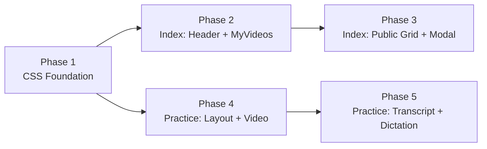

# Speaking Module Redesign — Phased Implementation Plan

> **Mục tiêu**: Chuyển đổi giao diện trang Speaking (Index + Practice) sang Stitch Design System dựa trên các mockup trong `docs/design-references/stitch_tct_english_platform_redesign/`.

> [!IMPORTANT]
> Mỗi phase phải giữ **100% functional parity** — không thay đổi Controller, Service, ViewModel, hay JS business logic. Chỉ thay đổi **View markup (`.cshtml`)** và **CSS (`.css`)**.

---

## Tổng quan Design Mockups

| Mockup | Đường dẫn | Mô tả |
|--------|-----------|-------|
| Speaking Index (Desktop) | `k_n_ng_n_i_tct_english/` | Trang chủ kỹ năng nói - bento grid, glass cards, CEFR tabs |
| Speaking Index (Mobile) | `k_n_ng_n_i_mobile_tct_english/` | Mobile: bottom nav, horizontal scroll cards, community section |
| Speaking Practice (Desktop) | `luy_n_n_i_tct_english/` | 3-column: sidebar + video/sentence + transcript panel |
| Speaking Practice (Mobile) | `luy_n_n_i_mobile_tct_english/` | Stacked vertical: video → sentence → controls → transcript |
| Design System | `tct_english_design_system/DESIGN.md` | Colors, typography, spacing, elevation tokens |

## Các File Cần Thay Đổi

| File | Dung lượng hiện tại | Mức thay đổi |
|------|---------------------|--------------|
| `wwwroot/css/speaking.css` | 146 dòng (6.4KB) | **Rewrite** → ~500-700 dòng |
| `Views/Speaking/Index.cshtml` | 358 dòng (19.5KB) | **Rewrite** markup, giữ Razor logic |
| `Views/Speaking/Practice.cshtml` | 331 dòng (18.4KB) | **Rewrite** markup, giữ Razor logic + inline JS |
| `wwwroot/js/speaking.js` | 1150 dòng (50KB) | **Minimal** — chỉ fix DOM selector nếu thay đổi `id`/`class` |

## Ràng buộc Quan trọng

> [!CAUTION]
> Các element ID dưới đây được tham chiếu bởi `speaking.js` và **KHÔNG ĐƯỢC thay đổi**:

### Index Page IDs (speaking.js Part 1)
```
vi-search, vi-video-count, vi-no-results
.topic-filter-btn, .level-filter-btn
.vi-video-col, .vi-level-section
.numbered-pagination-container, track-{level}
mip-url-input, mip-submit-btn, mip-btn-icon, mip-btn-label, mip-feedback
my-videos-grid, mip-loading-card, my-import-panel, my-empty-state
.my-video-card, .my-btn-delete
deleteVideoModal, delete-modal-title, delete-modal-confirm
```

### Practice Page IDs (speaking.js Part 2)
```
youtube-player, video-overlay, spk-subtitle-bar
btn-prev, btn-next, btn-replay, btn-record
record-icon, record-label, sent-indicator
current-transcript-en, current-transcript-vi
sentence-scroll-container, btn-slider-prev, btn-slider-next
prog-bar, prog-text, prog-pct
score-total, ring-total, bar-accuracy, bar-fluency, bar-complete
score-accuracy, score-fluency, score-complete
tab-pronunciation, tab-dictation
pronunciation-content, dictation-content
dic-sentence-scroll-container, btn-dic-slider-prev, btn-dic-slider-next
dic-input, dic-feedback, dic-sent-indicator
btn-dic-hint, btn-dic-play, dic-play-icon, dic-play-label
btn-dic-next, btn-dic-slow-play
spk-toast, btn-hide-text, btn-dic-hide-video
```

### CSS Classes tham chiếu bởi JS
```css
.spk-sent-btn, .spk-sent-btn--active, .spk-sent-btn--done
.spk-pill-active
.vi-card-hidden, .vi-section-hidden
.topic-filter-btn .active, .level-filter-btn .active
.is-recording, .is-scoring, .is-visible
.is-success, .is-error, .is-warning
.char-correct, .char-incorrect, .char-untyped
.d-none (Bootstrap utility)
```

---

## Phase 1: CSS Foundation & Design Tokens (~15 phút)

### Mục tiêu
Rewrite `speaking.css` để thiết lập toàn bộ Stitch design tokens và component classes mà Phase 2-5 sẽ sử dụng.

### File thay đổi
- `TCTEnglish/wwwroot/css/speaking.css` — **Full rewrite**

### Nội dung chi tiết

**1.1 — CSS Variables (Design Tokens)**
Giữ nguyên `:root` vars hiện có, bổ sung thêm tokens từ `DESIGN.md`:
```css
:root {
  /* Existing vars — KEEP ALL */
  --stitch-primary: #4255ff;
  /* ... */
  
  /* NEW tokens from mockup */
  --spk-font: 'Be Vietnam Pro', 'Inter', sans-serif;
  --spk-radius-card: 1.125rem;  /* 18px */
  --spk-radius-btn: 0.625rem;   /* 10px */
  --spk-radius-pill: 9999px;
  --spk-container-max: 1280px;
  --spk-sidebar-w: 260px;
  --spk-shadow-card: 0 2px 12px rgba(66, 85, 255, 0.06);
  --spk-shadow-lift: 0 10px 25px rgba(66, 85, 255, 0.08), 0 4px 10px rgba(0, 0, 0, 0.03);
  --spk-transition: 0.3s cubic-bezier(0.4, 0, 0.2, 1);
}
```

**1.2 — Glass Card Component**
```css
.spk-glass-card { ... }  /* glassmorphism card base */
.spk-glass-card:hover { ... }  /* hover lift effect */
```

**1.3 — Button System**
Giữ nguyên tất cả `.spk-btn` classes hiện tại, bổ sung:
```css
.spk-btn--outline { ... }  /* bordered button from mockup */
.spk-btn--pill { ... }     /* rounded pill for filters */
```

**1.4 — Layout Helpers**
```css
.spk-page-wrapper { ... }  /* main content wrapper with sidebar offset */
.spk-bento-grid { ... }    /* responsive bento-style grid */
```

**1.5 — KEEP tất cả JS-dependent styles**
Giữ nguyên 100%:
- `.vi-card-hidden`, `.vi-section-hidden`
- `.spk-sent-btn--active`, `.spk-sent-btn--done`
- `.spk-btn--record.is-recording`, `.is-scoring`
- `.char-correct`, `.char-incorrect`, `.char-untyped`
- `.spk-toast.*`
- `.spk-ring*`, `.spk-score-bar-*`
- `.page-btn.*`

### Acceptance Criteria
- [ ] Tất cả CSS variables từ DESIGN.md đã được map
- [ ] Glass card component có glassmorphism + hover lift
- [ ] Button system đầy đủ (primary, outline, pill, ghost, danger)
- [ ] Tất cả JS-dependent classes giữ nguyên
- [ ] Build/render không bị lỗi

---

## Phase 2: Index Page — Header, Filters & My Videos (~25 phút)

### Mục tiêu
Rewrite phần trên của `Index.cshtml` (header → filters → "Video của tôi") theo mockup desktop.

### File thay đổi
- `TCTEnglish/Views/Speaking/Index.cshtml` — Lines 1-199

### Nội dung chi tiết

**2.1 — Page Header** (mockup: hàng đầu tiên)
```
Hiện tại: <header class="spk-header mb-5">
Mới:     Bento header — h1 trái + stat chips phải
```
- Giữ Razor code: `@totalVideos`, `@Model.Topics.Count`
- Giữ `levelMeta` dictionary
- Giữ `id="vi-video-count"` cho JS counter

**2.2 — Import Panel**
```
Hiện tại: spk-import-panel (YouTube URL input)
Mới:     Stitch glass-card style, nhưng giữ nguyên form structure
```
- Giữ IDs: `my-import-panel`, `mip-url-input`, `mip-submit-btn`, `mip-btn-icon`, `mip-btn-label`, `mip-feedback`

**2.3 — Filters Section**
```
Hiện tại: spk-filters (level tabs + topic chips)
Mới:     Rounded pill filters + horizontal chip scroller
```
- Giữ classes: `.topic-filter-btn`, `.level-filter-btn`
- Giữ `data-level`, `data-topic` attributes
- Thêm `spk-chip--active` style thay cho active class

**2.4 — My Videos Grid**
```
Hiện tại: spk-grid spk-grid--3
Mới:     3-column bento grid với glass cards
```
- Giữ IDs: `my-videos-grid`, `mip-loading-card`, `my-empty-state`
- Giữ classes: `.my-video-card`, `.my-btn-delete`
- Giữ Razor logic: `@foreach`, status badges, lock/unlock
- Thêm new card styles: thumbnail with overlay, status badge (SẴN SÀNG/ĐANG XỬ LÝ)
- Thêm empty placeholder card (dashed border, add icon)

### Acceptance Criteria
- [ ] Header layout match mockup (h1 trái + stats phải)
- [ ] Filter pills horizontal scrollable
- [ ] My Videos cards có glass effect + status badges
- [ ] Empty state placeholder card hiển thị đúng
- [ ] Import panel form vẫn submit được
- [ ] Delete modal vẫn hoạt động

### Context Prompt cho Sonnet (Phase 2)
```
Bạn đang thực hiện Phase 2 của Speaking Redesign Plan.
Đọc plan tại: [path to this file]
Đọc mockup HTML: docs/design-references/stitch_tct_english_platform_redesign/k_n_ng_n_i_tct_english/code.html
Đọc mockup screenshot: docs/design-references/stitch_tct_english_platform_redesign/k_n_ng_n_i_tct_english/screen.png
Đọc current view: TCTEnglish/Views/Speaking/Index.cshtml
Đọc CSS (đã updated từ Phase 1): TCTEnglish/wwwroot/css/speaking.css

QUAN TRỌNG: Giữ nguyên tất cả IDs và class names listed trong "Ràng buộc Quan trọng" section.
Giữ nguyên @model, @section Styles, @section Scripts, @Html.AntiForgeryToken().
Chỉ thay đổi HTML markup structure và CSS classes.
```

---

## Phase 3: Index Page — Public Video Grid & Modal (~20 phút)

### Mục tiêu
Rewrite phần dưới `Index.cshtml` (public video library → CEFR sections → delete modal).

### File thay đổi
- `TCTEnglish/Views/Speaking/Index.cshtml` — Lines 200-358

### Nội dung chi tiết

**3.1 — Section Header** ("Video phổ biến theo trình độ")
```
Mới: Heading + grid/list toggle buttons
```
- Giữ view toggle HTML structure

**3.2 — CEFR Level Sections**
```
Hiện tại: vi-level-section → row g-4 → vi-video-col cards
Mới:     4-column responsive grid, video cards với:
         - Thumbnail (aspect 16:10) + level badge overlay + duration overlay
         - Topic label (uppercase, secondary color)
         - Title (2-line clamp)
         - Meta (sentence count + lượt học)
         - "Luyện tập" outline button
```
- Giữ attributes: `data-level`, `data-title`, `data-topic`
- Giữ classes: `.vi-level-section`, `.vi-video-col`
- Giữ IDs: `track-{level}`
- Giữ `.numbered-pagination-container[data-level]`
- Giữ `@Url.Action("Practice", "Speaking", new { id = item.Id })`

**3.3 — No Results & Empty State**
- Giữ `id="vi-no-results"`
- Giữ `.vi-empty`

**3.4 — Delete Modal**
```
Hiện tại: Bootstrap modal
Mới:     Stitch-styled modal (giữ Bootstrap JS behavior)
```
- Giữ IDs: `deleteVideoModal`, `deleteVideoModalLabel`, `delete-modal-title`, `delete-modal-confirm`
- Giữ `data-bs-dismiss="modal"` attributes

### Acceptance Criteria
- [ ] Video cards match mockup design (thumbnail + overlays + meta)
- [ ] CEFR level tabs filter đúng
- [ ] Pagination vẫn hoạt động
- [ ] Delete modal styled theo Stitch nhưng vẫn functional
- [ ] Responsive: 4 cols desktop → 2 cols tablet → 1 col mobile
- [ ] Topic/Level/Search filter vẫn hoạt động qua JS

### Context Prompt cho Sonnet (Phase 3)
```
Bạn đang thực hiện Phase 3 của Speaking Redesign Plan.
Đọc plan tại: [path]
Đọc mockup: k_n_ng_n_i_tct_english/code.html (lines 263-390 — public grid + bottom nav)
Đọc current view: TCTEnglish/Views/Speaking/Index.cshtml (từ line 200 trở đi)
Đã hoàn thành Phase 1 (CSS) và Phase 2 (header + my videos).

QUAN TRỌNG: Giữ tất cả IDs, data attributes, Razor @foreach, @Url.Action.
```

---

## Phase 4: Practice Page — Layout & Video Area (~25 phút)

### Mục tiêu
Rewrite `Practice.cshtml` — phần layout chính, video player, current sentence card, và score board.

### File thay đổi
- `TCTEnglish/Views/Speaking/Practice.cshtml` — Lines 1-210 (Pronunciation tab)
- `TCTEnglish/wwwroot/css/speaking.css` — Thêm Practice-specific styles

### Nội dung chi tiết

**4.1 — Practice Layout** (mockup: 3-panel)
```
Hiện tại: spk-practice-layout (flex: left + right)
Mới:     3 zones:
         - Left sidebar: tiến độ + nav menu
         - Center: video + sentence card + score + controls
         - Right: transcript panel (kịch bản bài học)
```

> [!WARNING]
> Practice page sử dụng `_Layout.cshtml` layout. Sidebar/nav đã có từ layout, đừng duplicate. Chỉ thêm "progress card" vào sidebar area (hoặc bỏ sidebar duplicate nếu layout đã cung cấp).

**4.2 — Video Player Section**
```
Mới: Rounded container + play button overlay + subtitle overlay
```
- Giữ: `id="youtube-player"`, `id="video-overlay"`, `id="spk-subtitle-bar"`

**4.3 — Current Sentence Card**
```
Mới: Glass card với left accent bar + badge "Câu hiện tại #04" + status
     + English text (large) + Vietnamese translation
     + Score ring + feedback text
     + Control buttons (volume, mic, replay)
```
- Giữ: `id="sent-indicator"`, `id="current-transcript-en"`, `id="current-transcript-vi"`
- Giữ: `id="btn-hide-text"`, `onclick="toggleText()"`
- Giữ: Score board IDs: `score-total`, `ring-total`, `bar-accuracy`, etc.
- Giữ: SVG ring structure for score display

**4.4 — Navigation Controls**
```
Mới: Bottom bar: "Câu trước" ← dots → "Câu tiếp theo" →
```
- Giữ: `id="btn-prev"`, `id="btn-next"`, `id="btn-replay"`, `id="btn-record"`
- Giữ: `id="record-icon"`, `id="record-label"`

**4.5 — Sentence Slider**
- Giữ: `id="sentence-scroll-container"`, `id="btn-slider-prev"`, `id="btn-slider-next"`
- Giữ: `.spk-sent-btn[data-index]`, `onclick="selectSentence(i)"`

### Acceptance Criteria
- [ ] 3-panel layout hoạt động trên desktop (sidebar + center + right)
- [ ] Video player renders YouTube iframe đúng
- [ ] Sentence card hiển thị text EN/VI
- [ ] Score ring SVG render đúng
- [ ] All navigation buttons work (prev/next/replay/record)
- [ ] Sentence slider scroll + select works
- [ ] Responsive: stacked trên mobile

### Context Prompt cho Sonnet (Phase 4)
```
Bạn đang thực hiện Phase 4 của Speaking Redesign Plan.
Đọc plan tại: [path]
Đọc mockup: luy_n_n_i_tct_english/code.html
Đọc mockup mobile: luy_n_n_i_mobile_tct_english/code.html  
Đọc current view: TCTEnglish/Views/Speaking/Practice.cshtml
Đọc JS: TCTEnglish/wwwroot/js/speaking.js (hiểu DOM refs ở lines 190-230)

QUAN TRỌNG: Practice page là phức tạp nhất. Ưu tiên giữ nguyên tất cả IDs.
Giữ nguyên inline JS (toggleText, toggleVideo, dic-input event listener).
Giữ nguyên @section Scripts block.
```

---

## Phase 5: Practice Page — Transcript Panel & Dictation Tab (~20 phút)

### Mục tiêu
Hoàn thiện Practice page: transcript panel bên phải + Dictation tab + responsive mobile + CSS polish.

### File thay đổi
- `TCTEnglish/Views/Speaking/Practice.cshtml` — Lines 210-331 (Dictation tab + scripts)
- `TCTEnglish/wwwroot/css/speaking.css` — Responsive + polish

### Nội dung chi tiết

**5.1 — Right Transcript Panel** (mockup: "Kịch bản bài học")
```
Mới: Fixed-width right panel (360px) với:
     - Header: "Kịch bản bài học" + "12/20" badge
     - Scrollable list:
       ✓ Completed sentences (green check icon)
       → Active sentence (highlighted, primary border)
       ○ Pending sentences (numbered circle)
     - Footer: "Gợi ý cải thiện từ AI" button (yellow)
```

**5.2 — Dictation Tab**
- Giữ nguyên functional structure
- Restyle theo Stitch tokens
- Giữ IDs: `dic-sentence-scroll-container`, `dic-input`, `dic-feedback`
- Giữ IDs: `btn-dic-hint`, `btn-dic-play`, `btn-dic-next`, `btn-dic-slow-play`
- Giữ `data-dic-index` attributes

**5.3 — Mobile Responsive**
```css
@media (max-width: 768px) {
  /* Stack vertically: video → sentence → controls → transcript */
  /* Transcript panel: full width, collapsible */
  /* Larger mic button */
  /* Bottom nav (handled by layout) */
}
```

**5.4 — Final CSS Polish**
- Typography: `Be Vietnam Pro` font đúng weight/size từ DESIGN.md
- Micro-animations: hover lifts, button press scales, smooth transitions
- Custom scrollbar styles
- Dark mode ready (CSS variables)

### Acceptance Criteria
- [ ] Transcript panel hiển thị sentences với status icons
- [ ] Active sentence highlighted
- [ ] "Gợi ý cải thiện từ AI" button visible
- [ ] Dictation tab fully functional
- [ ] Mobile layout stacked đúng
- [ ] Tất cả micro-animations smooth
- [ ] Toast notifications vẫn hoạt động
- [ ] Tab switching (Phát âm ↔ Nghe chép) vẫn hoạt động

### Context Prompt cho Sonnet (Phase 5)
```
Bạn đang thực hiện Phase 5 (cuối cùng) của Speaking Redesign Plan.
Đọc plan tại: [path]
Đọc mockup desktop: luy_n_n_i_tct_english/code.html (lines 278-371 — right panel)
Đọc mockup mobile: luy_n_n_i_mobile_tct_english/code.html
Đọc current view: TCTEnglish/Views/Speaking/Practice.cshtml (từ line 210 — dictation tab)
Đọc CSS (đã updated): TCTEnglish/wwwroot/css/speaking.css

Hoàn thiện responsive và polish. Đây là phase cuối.
```

---

## Checklist Cuối — Sau khi hoàn thành tất cả 5 Phase

- [ ] `dotnet build` thành công
- [ ] Trang `/Speaking` render đúng mockup desktop
- [ ] Trang `/Speaking` responsive trên mobile
- [ ] Trang `/Speaking/Practice/{id}` render đúng
- [ ] Filter by Topic hoạt động
- [ ] Filter by Level hoạt động
- [ ] Search hoạt động
- [ ] Import YouTube URL hoạt động
- [ ] Delete video hoạt động
- [ ] Practice: YouTube player load + seek
- [ ] Practice: Record + score display
- [ ] Practice: Sentence slider navigation
- [ ] Practice: Dictation tab functional
- [ ] Practice: Progress bar updates
- [ ] Practice: Toast notifications
- [ ] Practice: Tab switching
- [ ] Existing tests pass: `PremiumSpeakingLifecycleIntegrationTests`, `SpeakingLegacyNullMetadataIntegrationTests`, `SpeakingSchemaTests`
- [ ] Không có console errors

---

## Sơ đồ Dependency giữa các Phase



> [!TIP]
> Phase 1 phải làm trước. Sau đó có thể làm Phase 2→3 (Index) hoặc Phase 4→5 (Practice) theo thứ tự tùy ý, miễn mỗi track đi tuần tự.

---

## Tham chiếu nhanh

| Resource | Path |
|----------|------|
| Design System | `docs/design-references/stitch_tct_english_platform_redesign/tct_english_design_system/DESIGN.md` |
| Index Desktop Mockup | `docs/design-references/stitch_tct_english_platform_redesign/k_n_ng_n_i_tct_english/` |
| Index Mobile Mockup | `docs/design-references/stitch_tct_english_platform_redesign/k_n_ng_n_i_mobile_tct_english/` |
| Practice Desktop Mockup | `docs/design-references/stitch_tct_english_platform_redesign/luy_n_n_i_tct_english/` |
| Practice Mobile Mockup | `docs/design-references/stitch_tct_english_platform_redesign/luy_n_n_i_mobile_tct_english/` |
| Current CSS | `TCTEnglish/wwwroot/css/speaking.css` |
| Current JS | `TCTEnglish/wwwroot/js/speaking.js` |
| Index View | `TCTEnglish/Views/Speaking/Index.cshtml` |
| Practice View | `TCTEnglish/Views/Speaking/Practice.cshtml` |
| ViewModels | `TCTEnglish/ViewModels/SpeakingIndexViewModel.cs`, `SpeakingPracticeViewModel.cs` |
| Controller | `TCTEnglish/Controllers/SpeakingController.cs` |
| Tests | `TCTEnglish.Tests/PremiumSpeakingLifecycleIntegrationTests.cs`, `SpeakingSchemaTests.cs` |
